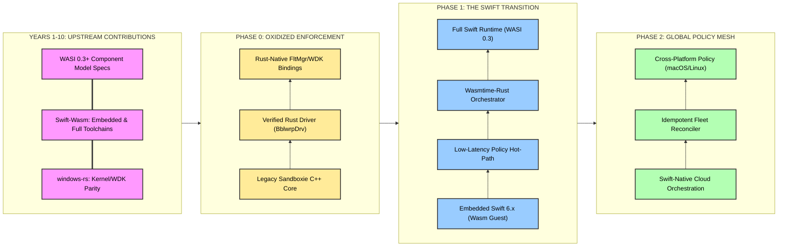
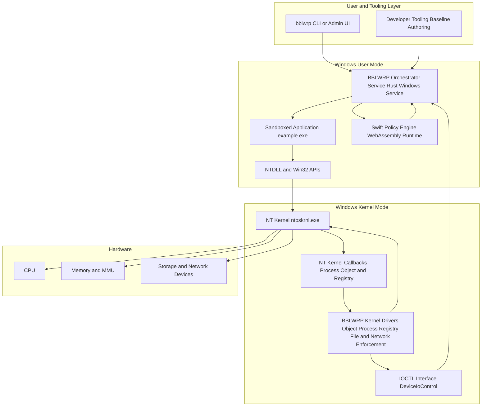
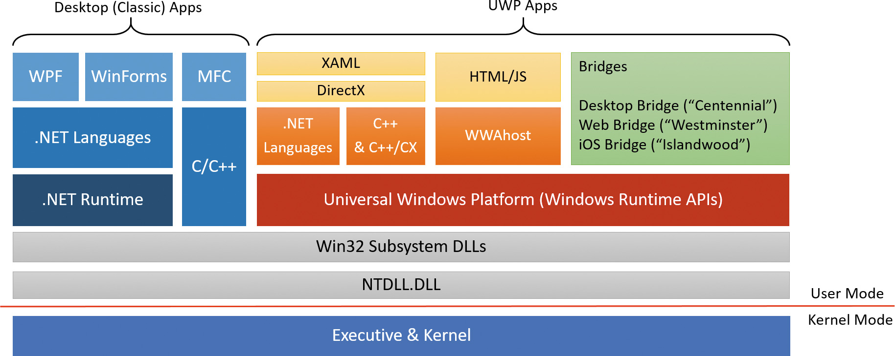

# Bblwrp

## BBLWRP Technical Roadmap: The 10-Year Vision

### Enterprise Sandboxing & Deployment Framework (2026–2036)

---

This is a formal draft outlining BBLWRP’s technical trajectory. Over the next decade, BBLWRP will act as a primary driver for the **Rust-for-Windows** and **Swift-to-Wasm** ecosystems.

---

## Overview

**BBLWRP** (pronounced *“bubble wrap”*) is a next-generation isolation platform. Built on a re-architected foundation derived from **Sandboxie Plus**, it replaces legacy C/C++ with a tiered, memory-safe architecture designed for high-stakes enterprise environments.

* **Enforcement Layer (Rust):** High-performance kernel-mode drivers providing the "oxidized" foundation for Windows.
* **Orchestration Layer (Swift):** High-level policy logic and fleet management.
* **Universal Execution (Wasm):** On non-Apple platforms, Swift is compiled into **WebAssembly Components**, executing within a Rust-hosted runtime for hardware-agnostic isolation.

---

## Strategic Core: Construction over Retrofitting

BBLWRP operates on the principle that **isolation must be enforced by construction**. We move away from reactive "patch-and-pray" security toward a formal proof of safety.

* **ABI Parity:** BBLWRP is committed to contributing to `windows-rs` to ensure Rust kernel abstractions have 1:1 parity with the Microsoft C++ WDK.
* **Full Swift Support:** Over 10 years, BBLWRP will drive the maturity of "Full Swift" (beyond the Embedded subset) on Wasm, enabling rich, concurrent policy engines that leverage the complete Swift standard library.
* **Idempotent State:** All sandbox deployments are declarative. The engine reconciles the system state against the Swift-defined policy module, ensuring absolute consistency across enterprise fleets.

---

## Language Strategy: The Swift-to-Wasm Pipeline

BBLWRP standardizes on a **Swift-to-Wasm** pipeline that evolves in two stages to meet both immediate performance needs and long-term scalability.

### 1. Short-term (Embedded Swift): The Transitional Bridge

Using the **Swift 6.2+ toolchain**, we utilize the "Embedded" subset of the language. This removes the overhead of a heavy runtime and garbage collection, allowing for:

* **Minimal Binaries:** Tiny Wasm modules that load with near-zero latency.
* **Determinism:** Predictable performance critical for kernel-level policy arbitration.
* **Zero-Runtime Interop:** Clean communication with the Rust host via Wasm Interface Types (WIT).

### 2. Long-term (Full Runtime): The Final Logic Plane

Utilizing the **WASI 0.3+ Component Model**, BBLWRP will host a shared Swift runtime as a Wasm component. This enables the **full language** (Reflection, Concurrency, Foundation) with minimal per-instance overhead, allowing for highly complex, identity-aware policy engines.

---

## Roadmap: 10-Year Phased Evolution

### Phase 0: The Oxidized Foundation (Years 1–4)

**Objective:** Establish a kernel-mode enforcement layer with native C++ parity.

* **Upstream Parity:** Contributions to `windows-rs` for undocumented NT-kernel APIs.
* **Verified Drivers:** Reimplementation of Sandboxie core filtering in Rust.
* **Native Hooks:** Leveraging Windows Kernel Callbacks (WDM/KTM) for object-level isolation.

### Phase 1: The Swift Transition (Years 3–7)

**Objective:** Transition the control plane to a high-concurrency Swift-Wasm engine.

* **Swift-Wasm Maturity:** Contributing to `swift-wasm` to stabilize the WASI 0.3 concurrency model.
* **Embedded-First Hot-Path:** Deploying low-latency policy engines in Embedded Swift for real-time I/O arbitration.
* **Component Orchestrator:** Rust-hosted **Wasmtime** engine to execute multi-threaded Full Swift policies as the spec matures.

### Phase 2: Global Policy Mesh (Years 6–10)

**Objective:** Cross-platform federation and idempotent deployment at scale.

* **Unified Semantics:** Applying the same Swift-Wasm policies across Windows (Rust-driver), macOS (`Virtualization.framework`), and Linux (eBPF).
* **Identity-Aware Isolation:** Native integration with Entra ID and SPIFFE for zero-trust policy assignment.

---

## BBLWRP Enterprise SDK Architecture

placeholder diagrams

## BBLWRP Windows Internals Mapping

Windows NT Architecture:

Gleaning from previous Windows systems level architectural patterns:

WSL:

<h1 id="wsl-overview">WSL Overview</h1>

WSL is comprised of a set of executables, API's and protocols. This page offers an overview of the different components, and how they're connected.
Click on any component to get more details.

<svg id="mermaid-1769117448228" width="100%" xmlns="http://www.w3.org/2000/svg" xmlns:xlink="http://www.w3.org/1999/xlink" class="flowchart" style="max-width: 1393.30078125px;" viewBox="0 0 1393.30078125 1366" role="graphics-document document" aria-roledescription="flowchart-v2"><g><marker id="mermaid-1769117448228_flowchart-v2-pointEnd" class="marker flowchart-v2" viewBox="0 0 10 10" refX="5" refY="5" markerUnits="userSpaceOnUse" markerWidth="8" markerHeight="8" orient="auto"><path d="M 0 0 L 10 5 L 0 10 z" class="arrowMarkerPath" style="stroke-width: 1; stroke-dasharray: 1, 0;"></path></marker><marker id="mermaid-1769117448228_flowchart-v2-pointStart" class="marker flowchart-v2" viewBox="0 0 10 10" refX="4.5" refY="5" markerUnits="userSpaceOnUse" markerWidth="8" markerHeight="8" orient="auto"><path d="M 0 5 L 10 10 L 10 0 z" class="arrowMarkerPath" style="stroke-width: 1; stroke-dasharray: 1, 0;"></path></marker><marker id="mermaid-1769117448228_flowchart-v2-circleEnd" class="marker flowchart-v2" viewBox="0 0 10 10" refX="11" refY="5" markerUnits="userSpaceOnUse" markerWidth="11" markerHeight="11" orient="auto"><circle cx="5" cy="5" r="5" class="arrowMarkerPath" style="stroke-width: 1; stroke-dasharray: 1, 0;"></circle></marker><marker id="mermaid-1769117448228_flowchart-v2-circleStart" class="marker flowchart-v2" viewBox="0 0 10 10" refX="-1" refY="5" markerUnits="userSpaceOnUse" markerWidth="11" markerHeight="11" orient="auto"><circle cx="5" cy="5" r="5" class="arrowMarkerPath" style="stroke-width: 1; stroke-dasharray: 1, 0;"></circle></marker><marker id="mermaid-1769117448228_flowchart-v2-crossEnd" class="marker cross flowchart-v2" viewBox="0 0 11 11" refX="12" refY="5.2" markerUnits="userSpaceOnUse" markerWidth="11" markerHeight="11" orient="auto"><path d="M 1,1 l 9,9 M 10,1 l -9,9" class="arrowMarkerPath" style="stroke-width: 2; stroke-dasharray: 1, 0;"></path></marker><marker id="mermaid-1769117448228_flowchart-v2-crossStart" class="marker cross flowchart-v2" viewBox="0 0 11 11" refX="-1" refY="5.2" markerUnits="userSpaceOnUse" markerWidth="11" markerHeight="11" orient="auto"><path d="M 1,1 l 9,9 M 10,1 l -9,9" class="arrowMarkerPath" style="stroke-width: 2; stroke-dasharray: 1, 0;"></path></marker><g class="root"><g class="clusters"><g class="cluster " id="Linux" data-look="classic"><rect style="" x="57.62109375" y="692" width="1244.0234375" height="666"></rect><g class="cluster-label " transform="translate(640.859375, 692)"><foreignObject width="77.546875" height="24">

<b></b>

<b>Linux</b>

</foreignObject></g></g><g class="cluster " id="Windows" data-look="classic"><rect style="" x="8" y="8" width="1377.30078125" height="512"></rect><g class="cluster-label " transform="translate(634.650390625, 8)"><foreignObject width="124" height="24">

<b></b>

<b>Windows</b>

</foreignObject></g></g><g class="cluster " id="Linux Distribution" data-look="classic"><rect style="" x="77.62109375" y="845" width="893.30078125" height="488"></rect><g class="cluster-label " transform="translate(427.638671875, 845)"><foreignObject width="193.265625" height="24">

<b></b>

<b>Linux Distribution</b>

</foreignObject></g></g></g><g class="edgePaths"><path d="M181.375,87L181.375,93.167C181.375,99.333,181.375,111.667,181.375,123.333C181.375,135,181.375,146,181.375,151.5L181.375,157" id="L_C:\Windows\System32\wsl.exe_wsl.exe_0" class=" edge-thickness-normal edge-pattern-solid edge-thickness-normal edge-pattern-solid flowchart-link" style="" marker-end="url(#mermaid-1769117448228_flowchart-v2-pointEnd)"></path><path d="M152.366,215L145.741,221.167C139.115,227.333,125.864,239.667,230.845,255.28C335.826,270.894,559.039,289.788,670.646,299.235L782.253,308.683" id="L_wsl.exe_wslservice.exe_1" class=" edge-thickness-normal edge-pattern-solid edge-thickness-normal edge-pattern-solid flowchart-link" style="" marker-end="url(#mermaid-1769117448228_flowchart-v2-pointEnd)"></path><path d="M349.844,215L349.844,221.167C349.844,227.333,349.844,239.667,421.915,254.723C493.985,269.78,638.127,287.559,710.198,296.449L782.268,305.339" id="L_wslg.exe_wslservice.exe_2" class=" edge-thickness-normal edge-pattern-solid edge-thickness-normal edge-pattern-solid flowchart-link" style="" marker-end="url(#mermaid-1769117448228_flowchart-v2-pointEnd)"></path><path d="M1037.715,215L1037.715,221.167C1037.715,227.333,1037.715,239.667,1022.053,251.764C1006.391,263.861,975.067,275.722,959.405,281.653L943.743,287.583" id="L_wslconfig.exe_wslservice.exe_3" class=" edge-thickness-normal edge-pattern-solid edge-thickness-normal edge-pattern-solid flowchart-link" style="" marker-end="url(#mermaid-1769117448228_flowchart-v2-pointEnd)"></path><path d="M1231.426,215L1231.426,221.167C1231.426,227.333,1231.426,239.667,1185.371,253.959C1139.317,268.252,1047.208,284.504,1001.154,292.63L955.099,300.755" id="L_wslapi.dll_wslservice.exe_4" class=" edge-thickness-normal edge-pattern-solid edge-thickness-normal edge-pattern-solid flowchart-link" style="" marker-end="url(#mermaid-1769117448228_flowchart-v2-pointEnd)"></path><path d="M1231.426,87L1231.426,93.167C1231.426,99.333,1231.426,111.667,1231.426,123.333C1231.426,135,1231.426,146,1231.426,151.5L1231.426,157" id="L_id_wslapi.dll_5" class=" edge-thickness-normal edge-pattern-solid edge-thickness-normal edge-pattern-solid flowchart-link" style="" marker-end="url(#mermaid-1769117448228_flowchart-v2-pointEnd)"></path><path d="M786.238,325.421L706.62,334.518C627.001,343.614,467.764,361.807,388.146,378.404C308.527,395,308.527,410,308.527,417.5L308.527,425" id="L_wslservice.exe_wslrelay.exe_6" class=" edge-thickness-normal edge-pattern-solid edge-thickness-normal edge-pattern-solid flowchart-link" style="" marker-end="url(#mermaid-1769117448228_flowchart-v2-pointEnd)"></path><path d="M846.066,343L840.897,349.167C835.728,355.333,825.389,367.667,820.22,381.333C815.051,395,815.051,410,815.051,417.5L815.051,425" id="L_wslservice.exe_wslhost.exe_7" class=" edge-thickness-normal edge-pattern-solid edge-thickness-normal edge-pattern-solid flowchart-link" style="" marker-end="url(#mermaid-1769117448228_flowchart-v2-pointEnd)"></path><path d="M906.984,343L915.729,349.167C924.473,355.333,941.961,367.667,950.705,386.5C959.449,405.333,959.449,430.667,959.449,454C959.449,477.333,959.449,498.667,959.449,515.5C959.449,532.333,959.449,544.667,959.449,559C959.449,573.333,959.449,589.667,959.449,606C959.449,622.333,959.449,638.667,959.449,653C959.449,667.333,959.449,679.667,959.449,689.333C959.449,699,959.449,706,959.449,709.5L959.449,713" id="L_wslservice.exe_mini_init_8" class=" edge-thickness-normal edge-pattern-solid edge-thickness-normal edge-pattern-solid flowchart-link" style="" marker-end="url(#mermaid-1769117448228_flowchart-v2-pointEnd)"></path><path d="M951.16,333.746L986.98,341.455C1022.801,349.164,1094.441,364.582,1130.262,384.958C1166.082,405.333,1166.082,430.667,1166.082,454C1166.082,477.333,1166.082,498.667,1166.082,515.5C1166.082,532.333,1166.082,544.667,1166.082,559C1166.082,573.333,1166.082,589.667,1166.082,606C1166.082,622.333,1166.082,638.667,1166.082,653C1166.082,667.333,1166.082,679.667,1166.082,694.5C1166.082,709.333,1166.082,726.667,1166.082,746C1166.082,765.333,1166.082,786.667,1166.082,803.5C1166.082,820.333,1166.082,832.667,1154.367,844.105C1142.652,855.543,1119.222,866.086,1107.507,871.357L1095.792,876.628" id="L_wslservice.exe_gns_9" class=" edge-thickness-normal edge-pattern-solid edge-thickness-normal edge-pattern-solid flowchart-link" style="" marker-end="url(#mermaid-1769117448228_flowchart-v2-pointEnd)"></path><path d="M562.754,495L562.754,499.167C562.754,503.333,562.754,511.667,562.754,522C562.754,532.333,562.754,544.667,562.754,559C562.754,573.333,562.754,589.667,562.754,606C562.754,622.333,562.754,638.667,562.754,653C562.754,667.333,562.754,679.667,562.754,694.5C562.754,709.333,562.754,726.667,562.754,746C562.754,765.333,562.754,786.667,562.754,803.5C562.754,820.333,562.754,832.667,562.754,847.5C562.754,862.333,562.754,879.667,562.754,899C562.754,918.333,562.754,939.667,564.594,955.867C566.435,972.068,570.116,983.136,571.957,988.67L573.797,994.204" id="L_fs_plan9_10" class=" edge-thickness-normal edge-pattern-solid edge-thickness-normal edge-pattern-solid flowchart-link" style="" marker-end="url(#mermaid-1769117448228_flowchart-v2-pointEnd)"></path><path d="M188.937,215L190.665,221.167C192.392,227.333,195.846,239.667,197.574,256.5C199.301,273.333,199.301,294.667,199.301,316C199.301,337.333,199.301,358.667,199.301,382C199.301,405.333,199.301,430.667,199.301,454C199.301,477.333,199.301,498.667,199.301,515.5C199.301,532.333,199.301,544.667,199.301,559C199.301,573.333,199.301,589.667,199.301,606C199.301,622.333,199.301,638.667,199.301,653C199.301,667.333,199.301,679.667,199.301,694.5C199.301,709.333,199.301,726.667,199.301,746C199.301,765.333,199.301,786.667,199.301,803.5C199.301,820.333,199.301,832.667,199.301,847.5C199.301,862.333,199.301,879.667,199.301,899C199.301,918.333,199.301,939.667,199.301,961C199.301,982.333,199.301,1003.667,199.301,1025C199.301,1046.333,199.301,1067.667,223.747,1086.216C248.193,1104.766,297.086,1120.533,321.532,1128.416L345.978,1136.299" id="L_wsl.exe_relay_11" class=" edge-thickness-normal edge-pattern-solid edge-thickness-normal edge-pattern-solid flowchart-link" style="" marker-end="url(#mermaid-1769117448228_flowchart-v2-pointEnd)"></path><path d="M924.63,771L916.677,777.167C908.724,783.333,892.819,795.667,908.587,808C924.354,820.333,971.794,832.667,997.677,842.429C1023.561,852.191,1027.887,859.382,1030.05,862.977L1032.213,866.573" id="L_mini_init_gns_12" class=" edge-thickness-normal edge-pattern-solid edge-thickness-normal edge-pattern-solid flowchart-link" style="" marker-end="url(#mermaid-1769117448228_flowchart-v2-pointEnd)"></path><path d="M962.472,771L963.162,777.167C963.852,783.333,965.233,795.667,938.14,808C911.048,820.333,855.483,832.667,827.701,842.333C799.918,852,799.918,859,799.918,862.5L799.918,866" id="L_mini_init_init_13" class=" edge-thickness-normal edge-pattern-solid edge-thickness-normal edge-pattern-solid flowchart-link" style="" marker-end="url(#mermaid-1769117448228_flowchart-v2-pointEnd)"></path><path d="M1021.324,770.99L1035.465,777.158C1049.607,783.326,1077.889,795.663,1092.031,807.998C1106.172,820.333,1106.172,832.667,1113.453,842.688C1120.734,852.709,1135.297,860.419,1142.578,864.274L1149.859,868.128" id="L_mini_init_localhost_14" class=" edge-thickness-normal edge-pattern-solid edge-thickness-normal edge-pattern-solid flowchart-link" style="" marker-end="url(#mermaid-1769117448228_flowchart-v2-pointEnd)"></path><path d="M757.809,914.002L738.408,921.835C719.008,929.668,680.207,945.334,655.724,958.837C631.241,972.34,621.076,983.681,615.993,989.351L610.911,995.021" id="L_init_plan9_15" class=" edge-thickness-normal edge-pattern-solid edge-thickness-normal edge-pattern-solid flowchart-link" style="" marker-end="url(#mermaid-1769117448228_flowchart-v2-pointEnd)"></path><path d="M813.659,924L816.797,930.167C819.935,936.333,826.212,948.667,829.35,960.333C832.488,972,832.488,983,832.488,988.5L832.488,994" id="L_init_sid_16" class=" edge-thickness-normal edge-pattern-solid edge-thickness-normal edge-pattern-solid flowchart-link" style="" marker-end="url(#mermaid-1769117448228_flowchart-v2-pointEnd)"></path><path d="M832.488,1052L832.488,1058.167C832.488,1064.333,832.488,1076.667,768.692,1092.226C704.896,1107.784,577.304,1126.569,513.507,1135.961L449.711,1145.353" id="L_sid_relay_17" class=" edge-thickness-normal edge-pattern-solid edge-thickness-normal edge-pattern-solid flowchart-link" style="" marker-end="url(#mermaid-1769117448228_flowchart-v2-pointEnd)"></path><path d="M397.77,1180L397.77,1186.167C397.77,1192.333,397.77,1204.667,397.77,1216.333C397.77,1228,397.77,1239,397.77,1244.5L397.77,1250" id="L_relay_cid_18" class=" edge-thickness-normal edge-pattern-solid edge-thickness-normal edge-pattern-solid flowchart-link" style="" marker-end="url(#mermaid-1769117448228_flowchart-v2-pointEnd)"></path></g><g class="edgeLabels"><g class="edgeLabel" transform="translate(181.375, 124)"><g class="label" transform="translate(-56.1640625, -12)"><foreignObject width="112.328125" height="24">

CreateProcess()

</foreignObject></g></g><g class="edgeLabel" transform="translate(112.61328125, 252)"><g class="label" transform="translate(-15.8515625, -12)"><foreignObject width="31.703125" height="24">

COM

</foreignObject></g></g><g class="edgeLabel" transform="translate(349.84375, 252)"><g class="label" transform="translate(-15.8515625, -12)"><foreignObject width="31.703125" height="24">

COM

</foreignObject></g></g><g class="edgeLabel" transform="translate(1037.71484375, 252)"><g class="label" transform="translate(-15.8515625, -12)"><foreignObject width="31.703125" height="24">

COM

</foreignObject></g></g><g class="edgeLabel" transform="translate(1231.42578125, 252)"><g class="label" transform="translate(-15.8515625, -12)"><foreignObject width="31.703125" height="24">

COM

</foreignObject></g></g><g class="edgeLabel" transform="translate(1231.42578125, 124)"><g class="label" transform="translate(-48.0390625, -12)"><foreignObject width="96.078125" height="24">

LoadLibrary()

</foreignObject></g></g><g class="edgeLabel" transform="translate(308.52734375, 380)"><g class="label" transform="translate(-80.015625, -12)"><foreignObject width="160.03125" height="24">

CreateProcessAsUser()

</foreignObject></g></g><g class="edgeLabel" transform="translate(815.05078125, 380)"><g class="label" transform="translate(-80.015625, -12)"><foreignObject width="160.03125" height="24">

CreateProcessAsUser()

</foreignObject></g></g><g class="edgeLabel" transform="translate(959.44921875, 557)"><g class="label" transform="translate(-31.3515625, -12)"><foreignObject width="62.703125" height="24">

hvsocket

</foreignObject></g></g><g class="edgeLabel" transform="translate(1166.08203125, 606)"><g class="label" transform="translate(-31.3515625, -12)"><foreignObject width="62.703125" height="24">

hvsocket

</foreignObject></g></g><g class="edgeLabel" transform="translate(562.75390625, 744)"><g class="label" transform="translate(-31.3515625, -12)"><foreignObject width="62.703125" height="24">

hvsocket

</foreignObject></g></g><g class="edgeLabel" transform="translate(199.30078125, 655)"><g class="label" transform="translate(-31.3515625, -12)"><foreignObject width="62.703125" height="24">

hvsocket

</foreignObject></g></g><g class="edgeLabel" transform="translate(876.9140625, 808)"><g class="label" transform="translate(-22.5703125, -12)"><foreignObject width="45.140625" height="24">

exec()

</foreignObject></g></g><g class="edgeLabel" transform="translate(966.61328125, 808)"><g class="label" transform="translate(-22.5703125, -12)"><foreignObject width="45.140625" height="24">

exec()

</foreignObject></g></g><g class="edgeLabel" transform="translate(1106.171875, 808)"><g class="label" transform="translate(-22.5703125, -12)"><foreignObject width="45.140625" height="24">

exec()

</foreignObject></g></g><g class="edgeLabel" transform="translate(641.40625, 961)"><g class="label" transform="translate(-22.5703125, -12)"><foreignObject width="45.140625" height="24">

exec()

</foreignObject></g></g><g class="edgeLabel" transform="translate(832.48828125, 961)"><g class="label" transform="translate(-22.5703125, -12)"><foreignObject width="45.140625" height="24">

exec()

</foreignObject></g></g><g class="edgeLabel" transform="translate(832.48828125, 1089)"><g class="label" transform="translate(-22.5703125, -12)"><foreignObject width="45.140625" height="24">

exec()

</foreignObject></g></g><g class="edgeLabel" transform="translate(397.76953125, 1217)"><g class="label" transform="translate(-22.5703125, -12)"><foreignObject width="45.140625" height="24">

exec()

</foreignObject></g></g></g><g class="nodes"><g class="node default" id="flowchart-C:\Windows\System32\wsl.exe-0" transform="translate(181.375, 60)"><rect class="basic label-container" style="" x="-138.375" y="-27" width="276.75" height="54"></rect><g class="label" style="" transform="translate(-108.375, -12)"><rect></rect><foreignObject width="216.75" height="24">

C:\Windows\System32\wsl.exe

</foreignObject></g></g><g class="node default  " id="flowchart-wsl.exe-1" transform="translate(181.375, 188)"><rect class="basic label-container" style="" x="-57.2265625" y="-27" width="114.453125" height="54"></rect><g class="label" style="" transform="translate(-27.2265625, -12)"><rect></rect><foreignObject width="54.453125" height="24">

<a href="wsl.exe">wsl.exe</a>

</foreignObject></g></g><g class="node default  " id="flowchart-wslservice.exe-3" transform="translate(868.69921875, 316)"><rect class="basic label-container" style="" x="-82.4609375" y="-27" width="164.921875" height="54"></rect><g class="label" style="" transform="translate(-52.4609375, -12)"><rect></rect><foreignObject width="104.921875" height="24">

<a href="wslservice.exe">wslservice.exe</a>

</foreignObject></g></g><g class="node default" id="flowchart-wslg.exe-4" transform="translate(349.84375, 188)"><rect class="basic label-container" style="" x="-61.2421875" y="-27" width="122.484375" height="54"></rect><g class="label" style="" transform="translate(-31.2421875, -12)"><rect></rect><foreignObject width="62.484375" height="24">

<a href="wslg.exe">wslg.exe</a>

</foreignObject></g></g><g class="node default  " id="flowchart-wslconfig.exe-6" transform="translate(1037.71484375, 188)"><rect class="basic label-container" style="" x="-79.1015625" y="-27" width="158.203125" height="54"></rect><g class="label" style="" transform="translate(-49.1015625, -12)"><rect></rect><foreignObject width="98.203125" height="24">

<a href="wslconfig.exe">wslconfig.exe</a>

</foreignObject></g></g><g class="node default" id="flowchart-wslapi.dll-8" transform="translate(1231.42578125, 188)"><rect class="basic label-container" style="" x="-64.609375" y="-27" width="129.21875" height="54"></rect><g class="label" style="" transform="translate(-34.609375, -12)"><rect></rect><foreignObject width="69.21875" height="24">

<a href="https://learn.microsoft.com/windows/win32/api/wslapi/">wslapi.dll</a>

</foreignObject></g></g><g class="node default  " id="flowchart-id-10" transform="translate(1231.42578125, 60)"><rect class="basic label-container" style="" x="-118.875" y="-27" width="237.75" height="54"></rect><g class="label" style="" transform="translate(-88.875, -12)"><rect></rect><foreignObject width="177.75" height="24">

debian.exe, ubuntu.exe,

</foreignObject></g></g><g class="node default  " id="flowchart-wslrelay.exe-13" transform="translate(308.52734375, 456)"><rect class="basic label-container" style="" x="-74.2265625" y="-27" width="148.453125" height="54"></rect><g class="label" style="" transform="translate(-44.2265625, -12)"><rect></rect><foreignObject width="88.453125" height="24">

<a href="wslrelay.exe">wslrelay.exe</a>

</foreignObject></g></g><g class="node default  " id="flowchart-wslhost.exe-15" transform="translate(815.05078125, 456)"><rect class="basic label-container" style="" x="-72.296875" y="-27" width="144.59375" height="54"></rect><g class="label" style="" transform="translate(-42.296875, -12)"><rect></rect><foreignObject width="84.59375" height="24">

<a href="wslhost.exe">wslhost.exe</a>

</foreignObject></g></g><g class="node default" id="flowchart-fs-16" transform="translate(562.75390625, 456)"><rect class="basic label-container" style="" x="-130" y="-39" width="260" height="78"></rect><g class="label" style="" transform="translate(-100, -24)"><rect></rect><foreignObject width="200" height="48">

Windows filesystem (//wsl.localhost)

</foreignObject></g></g><g class="node default" id="flowchart-mini_init-18" transform="translate(959.44921875, 744)"><rect class="basic label-container" style="" x="-61.875" y="-27" width="123.75" height="54"></rect><g class="label" style="" transform="translate(-31.875, -12)"><rect></rect><foreignObject width="63.75" height="24">

<a href="mini_init">mini_init</a>

</foreignObject></g></g><g class="node default" id="flowchart-gns-20" transform="translate(1050.51953125, 897)"><rect class="basic label-container" style="" x="-41.625" y="-27" width="83.25" height="54"></rect><g class="label" style="" transform="translate(-11.625, -12)"><rect></rect><foreignObject width="23.25" height="24">

<a href="gns">gns</a>

</foreignObject></g></g><g class="node default  " id="flowchart-plan9-22" transform="translate(584.0390625, 1025)"><rect class="basic label-container" style="" x="-49.5859375" y="-27" width="99.171875" height="54"></rect><g class="label" style="" transform="translate(-19.5859375, -12)"><rect></rect><foreignObject width="39.171875" height="24">

<a href="plan9">plan9</a>

</foreignObject></g></g><g class="node default  " id="flowchart-relay-24" transform="translate(397.76953125, 1153)"><rect class="basic label-container" style="" x="-47.984375" y="-27" width="95.96875" height="54"></rect><g class="label" style="" transform="translate(-17.984375, -12)"><rect></rect><foreignObject width="35.96875" height="24">

<a href="relay">relay</a>

</foreignObject></g></g><g class="node default  " id="flowchart-init-28" transform="translate(799.91796875, 897)"><rect class="basic label-container" style="" x="-42.109375" y="-27" width="84.21875" height="54"></rect><g class="label" style="" transform="translate(-12.109375, -12)"><rect></rect><foreignObject width="24.21875" height="24">

<a href="init">init</a>

</foreignObject></g></g><g class="node default  " id="flowchart-localhost-30" transform="translate(1204.39453125, 897)"><rect class="basic label-container" style="" x="-62.25" y="-27" width="124.5" height="54"></rect><g class="label" style="" transform="translate(-32.25, -12)"><rect></rect><foreignObject width="64.5" height="24">

<a href="localhost">localhost</a>

</foreignObject></g></g><g class="node default" id="flowchart-sid-34" transform="translate(832.48828125, 1025)"><rect class="basic label-container" style="" x="-80.2890625" y="-27" width="160.578125" height="54"></rect><g class="label" style="" transform="translate(-50.2890625, -12)"><rect></rect><foreignObject width="100.578125" height="24">

<a href="session-leader">session leader</a>

</foreignObject></g></g><g class="node default  " id="flowchart-cid-38" transform="translate(397.76953125, 1281)"><rect class="basic label-container" style="" x="-126.578125" y="-27" width="253.15625" height="54"></rect><g class="label" style="" transform="translate(-96.578125, -12)"><rect></rect><foreignObject width="193.15625" height="24">

User command (bash, curl)

</foreignObject></g></g></g></g></g></svg>

<h1 id="wsl-overview">WSL Overview</h1>

WSL is comprised of a set of executables, API's and protocols. This page offers an overview of the different components, and how they're connected.
Click on any component to get more details.

<svg id="mermaid-1769117448228" width="100%" xmlns="http://www.w3.org/2000/svg" xmlns:xlink="http://www.w3.org/1999/xlink" class="flowchart" style="max-width: 1393.30078125px;" viewBox="0 0 1393.30078125 1366" role="graphics-document document" aria-roledescription="flowchart-v2"><g><marker id="mermaid-1769117448228_flowchart-v2-pointEnd" class="marker flowchart-v2" viewBox="0 0 10 10" refX="5" refY="5" markerUnits="userSpaceOnUse" markerWidth="8" markerHeight="8" orient="auto"><path d="M 0 0 L 10 5 L 0 10 z" class="arrowMarkerPath" style="stroke-width: 1; stroke-dasharray: 1, 0;"></path></marker><marker id="mermaid-1769117448228_flowchart-v2-pointStart" class="marker flowchart-v2" viewBox="0 0 10 10" refX="4.5" refY="5" markerUnits="userSpaceOnUse" markerWidth="8" markerHeight="8" orient="auto"><path d="M 0 5 L 10 10 L 10 0 z" class="arrowMarkerPath" style="stroke-width: 1; stroke-dasharray: 1, 0;"></path></marker><marker id="mermaid-1769117448228_flowchart-v2-circleEnd" class="marker flowchart-v2" viewBox="0 0 10 10" refX="11" refY="5" markerUnits="userSpaceOnUse" markerWidth="11" markerHeight="11" orient="auto"><circle cx="5" cy="5" r="5" class="arrowMarkerPath" style="stroke-width: 1; stroke-dasharray: 1, 0;"></circle></marker><marker id="mermaid-1769117448228_flowchart-v2-circleStart" class="marker flowchart-v2" viewBox="0 0 10 10" refX="-1" refY="5" markerUnits="userSpaceOnUse" markerWidth="11" markerHeight="11" orient="auto"><circle cx="5" cy="5" r="5" class="arrowMarkerPath" style="stroke-width: 1; stroke-dasharray: 1, 0;"></circle></marker><marker id="mermaid-1769117448228_flowchart-v2-crossEnd" class="marker cross flowchart-v2" viewBox="0 0 11 11" refX="12" refY="5.2" markerUnits="userSpaceOnUse" markerWidth="11" markerHeight="11" orient="auto"><path d="M 1,1 l 9,9 M 10,1 l -9,9" class="arrowMarkerPath" style="stroke-width: 2; stroke-dasharray: 1, 0;"></path></marker><marker id="mermaid-1769117448228_flowchart-v2-crossStart" class="marker cross flowchart-v2" viewBox="0 0 11 11" refX="-1" refY="5.2" markerUnits="userSpaceOnUse" markerWidth="11" markerHeight="11" orient="auto"><path d="M 1,1 l 9,9 M 10,1 l -9,9" class="arrowMarkerPath" style="stroke-width: 2; stroke-dasharray: 1, 0;"></path></marker><g class="root"><g class="clusters"><g class="cluster " id="Linux" data-look="classic"><rect style="" x="57.62109375" y="692" width="1244.0234375" height="666"></rect><g class="cluster-label " transform="translate(640.859375, 692)"><foreignObject width="77.546875" height="24">

<b></b>

<b>Linux</b>

</foreignObject></g></g><g class="cluster " id="Windows" data-look="classic"><rect style="" x="8" y="8" width="1377.30078125" height="512"></rect><g class="cluster-label " transform="translate(634.650390625, 8)"><foreignObject width="124" height="24">

<b></b>

<b>Windows</b>

</foreignObject></g></g><g class="cluster " id="Linux Distribution" data-look="classic"><rect style="" x="77.62109375" y="845" width="893.30078125" height="488"></rect><g class="cluster-label " transform="translate(427.638671875, 845)"><foreignObject width="193.265625" height="24">

<b></b>

<b>Linux Distribution</b>

</foreignObject></g></g></g><g class="edgePaths"><path d="M181.375,87L181.375,93.167C181.375,99.333,181.375,111.667,181.375,123.333C181.375,135,181.375,146,181.375,151.5L181.375,157" id="L_C:\Windows\System32\wsl.exe_wsl.exe_0" class=" edge-thickness-normal edge-pattern-solid edge-thickness-normal edge-pattern-solid flowchart-link" style="" marker-end="url(#mermaid-1769117448228_flowchart-v2-pointEnd)"></path><path d="M152.366,215L145.741,221.167C139.115,227.333,125.864,239.667,230.845,255.28C335.826,270.894,559.039,289.788,670.646,299.235L782.253,308.683" id="L_wsl.exe_wslservice.exe_1" class=" edge-thickness-normal edge-pattern-solid edge-thickness-normal edge-pattern-solid flowchart-link" style="" marker-end="url(#mermaid-1769117448228_flowchart-v2-pointEnd)"></path><path d="M349.844,215L349.844,221.167C349.844,227.333,349.844,239.667,421.915,254.723C493.985,269.78,638.127,287.559,710.198,296.449L782.268,305.339" id="L_wslg.exe_wslservice.exe_2" class=" edge-thickness-normal edge-pattern-solid edge-thickness-normal edge-pattern-solid flowchart-link" style="" marker-end="url(#mermaid-1769117448228_flowchart-v2-pointEnd)"></path><path d="M1037.715,215L1037.715,221.167C1037.715,227.333,1037.715,239.667,1022.053,251.764C1006.391,263.861,975.067,275.722,959.405,281.653L943.743,287.583" id="L_wslconfig.exe_wslservice.exe_3" class=" edge-thickness-normal edge-pattern-solid edge-thickness-normal edge-pattern-solid flowchart-link" style="" marker-end="url(#mermaid-1769117448228_flowchart-v2-pointEnd)"></path><path d="M1231.426,215L1231.426,221.167C1231.426,227.333,1231.426,239.667,1185.371,253.959C1139.317,268.252,1047.208,284.504,1001.154,292.63L955.099,300.755" id="L_wslapi.dll_wslservice.exe_4" class=" edge-thickness-normal edge-pattern-solid edge-thickness-normal edge-pattern-solid flowchart-link" style="" marker-end="url(#mermaid-1769117448228_flowchart-v2-pointEnd)"></path><path d="M1231.426,87L1231.426,93.167C1231.426,99.333,1231.426,111.667,1231.426,123.333C1231.426,135,1231.426,146,1231.426,151.5L1231.426,157" id="L_id_wslapi.dll_5" class=" edge-thickness-normal edge-pattern-solid edge-thickness-normal edge-pattern-solid flowchart-link" style="" marker-end="url(#mermaid-1769117448228_flowchart-v2-pointEnd)"></path><path d="M786.238,325.421L706.62,334.518C627.001,343.614,467.764,361.807,388.146,378.404C308.527,395,308.527,410,308.527,417.5L308.527,425" id="L_wslservice.exe_wslrelay.exe_6" class=" edge-thickness-normal edge-pattern-solid edge-thickness-normal edge-pattern-solid flowchart-link" style="" marker-end="url(#mermaid-1769117448228_flowchart-v2-pointEnd)"></path><path d="M846.066,343L840.897,349.167C835.728,355.333,825.389,367.667,820.22,381.333C815.051,395,815.051,410,815.051,417.5L815.051,425" id="L_wslservice.exe_wslhost.exe_7" class=" edge-thickness-normal edge-pattern-solid edge-thickness-normal edge-pattern-solid flowchart-link" style="" marker-end="url(#mermaid-1769117448228_flowchart-v2-pointEnd)"></path><path d="M906.984,343L915.729,349.167C924.473,355.333,941.961,367.667,950.705,386.5C959.449,405.333,959.449,430.667,959.449,454C959.449,477.333,959.449,498.667,959.449,515.5C959.449,532.333,959.449,544.667,959.449,559C959.449,573.333,959.449,589.667,959.449,606C959.449,622.333,959.449,638.667,959.449,653C959.449,667.333,959.449,679.667,959.449,689.333C959.449,699,959.449,706,959.449,709.5L959.449,713" id="L_wslservice.exe_mini_init_8" class=" edge-thickness-normal edge-pattern-solid edge-thickness-normal edge-pattern-solid flowchart-link" style="" marker-end="url(#mermaid-1769117448228_flowchart-v2-pointEnd)"></path><path d="M951.16,333.746L986.98,341.455C1022.801,349.164,1094.441,364.582,1130.262,384.958C1166.082,405.333,1166.082,430.667,1166.082,454C1166.082,477.333,1166.082,498.667,1166.082,515.5C1166.082,532.333,1166.082,544.667,1166.082,559C1166.082,573.333,1166.082,589.667,1166.082,606C1166.082,622.333,1166.082,638.667,1166.082,653C1166.082,667.333,1166.082,679.667,1166.082,694.5C1166.082,709.333,1166.082,726.667,1166.082,746C1166.082,765.333,1166.082,786.667,1166.082,803.5C1166.082,820.333,1166.082,832.667,1154.367,844.105C1142.652,855.543,1119.222,866.086,1107.507,871.357L1095.792,876.628" id="L_wslservice.exe_gns_9" class=" edge-thickness-normal edge-pattern-solid edge-thickness-normal edge-pattern-solid flowchart-link" style="" marker-end="url(#mermaid-1769117448228_flowchart-v2-pointEnd)"></path><path d="M562.754,495L562.754,499.167C562.754,503.333,562.754,511.667,562.754,522C562.754,532.333,562.754,544.667,562.754,559C562.754,573.333,562.754,589.667,562.754,606C562.754,622.333,562.754,638.667,562.754,653C562.754,667.333,562.754,679.667,562.754,694.5C562.754,709.333,562.754,726.667,562.754,746C562.754,765.333,562.754,786.667,562.754,803.5C562.754,820.333,562.754,832.667,562.754,847.5C562.754,862.333,562.754,879.667,562.754,899C562.754,918.333,562.754,939.667,564.594,955.867C566.435,972.068,570.116,983.136,571.957,988.67L573.797,994.204" id="L_fs_plan9_10" class=" edge-thickness-normal edge-pattern-solid edge-thickness-normal edge-pattern-solid flowchart-link" style="" marker-end="url(#mermaid-1769117448228_flowchart-v2-pointEnd)"></path><path d="M188.937,215L190.665,221.167C192.392,227.333,195.846,239.667,197.574,256.5C199.301,273.333,199.301,294.667,199.301,316C199.301,337.333,199.301,358.667,199.301,382C199.301,405.333,199.301,430.667,199.301,454C199.301,477.333,199.301,498.667,199.301,515.5C199.301,532.333,199.301,544.667,199.301,559C199.301,573.333,199.301,589.667,199.301,606C199.301,622.333,199.301,638.667,199.301,653C199.301,667.333,199.301,679.667,199.301,694.5C199.301,709.333,199.301,726.667,199.301,746C199.301,765.333,199.301,786.667,199.301,803.5C199.301,820.333,199.301,832.667,199.301,847.5C199.301,862.333,199.301,879.667,199.301,899C199.301,918.333,199.301,939.667,199.301,961C199.301,982.333,199.301,1003.667,199.301,1025C199.301,1046.333,199.301,1067.667,223.747,1086.216C248.193,1104.766,297.086,1120.533,321.532,1128.416L345.978,1136.299" id="L_wsl.exe_relay_11" class=" edge-thickness-normal edge-pattern-solid edge-thickness-normal edge-pattern-solid flowchart-link" style="" marker-end="url(#mermaid-1769117448228_flowchart-v2-pointEnd)"></path><path d="M924.63,771L916.677,777.167C908.724,783.333,892.819,795.667,908.587,808C924.354,820.333,971.794,832.667,997.677,842.429C1023.561,852.191,1027.887,859.382,1030.05,862.977L1032.213,866.573" id="L_mini_init_gns_12" class=" edge-thickness-normal edge-pattern-solid edge-thickness-normal edge-pattern-solid flowchart-link" style="" marker-end="url(#mermaid-1769117448228_flowchart-v2-pointEnd)"></path><path d="M962.472,771L963.162,777.167C963.852,783.333,965.233,795.667,938.14,808C911.048,820.333,855.483,832.667,827.701,842.333C799.918,852,799.918,859,799.918,862.5L799.918,866" id="L_mini_init_init_13" class=" edge-thickness-normal edge-pattern-solid edge-thickness-normal edge-pattern-solid flowchart-link" style="" marker-end="url(#mermaid-1769117448228_flowchart-v2-pointEnd)"></path><path d="M1021.324,770.99L1035.465,777.158C1049.607,783.326,1077.889,795.663,1092.031,807.998C1106.172,820.333,1106.172,832.667,1113.453,842.688C1120.734,852.709,1135.297,860.419,1142.578,864.274L1149.859,868.128" id="L_mini_init_localhost_14" class=" edge-thickness-normal edge-pattern-solid edge-thickness-normal edge-pattern-solid flowchart-link" style="" marker-end="url(#mermaid-1769117448228_flowchart-v2-pointEnd)"></path><path d="M757.809,914.002L738.408,921.835C719.008,929.668,680.207,945.334,655.724,958.837C631.241,972.34,621.076,983.681,615.993,989.351L610.911,995.021" id="L_init_plan9_15" class=" edge-thickness-normal edge-pattern-solid edge-thickness-normal edge-pattern-solid flowchart-link" style="" marker-end="url(#mermaid-1769117448228_flowchart-v2-pointEnd)"></path><path d="M813.659,924L816.797,930.167C819.935,936.333,826.212,948.667,829.35,960.333C832.488,972,832.488,983,832.488,988.5L832.488,994" id="L_init_sid_16" class=" edge-thickness-normal edge-pattern-solid edge-thickness-normal edge-pattern-solid flowchart-link" style="" marker-end="url(#mermaid-1769117448228_flowchart-v2-pointEnd)"></path><path d="M832.488,1052L832.488,1058.167C832.488,1064.333,832.488,1076.667,768.692,1092.226C704.896,1107.784,577.304,1126.569,513.507,1135.961L449.711,1145.353" id="L_sid_relay_17" class=" edge-thickness-normal edge-pattern-solid edge-thickness-normal edge-pattern-solid flowchart-link" style="" marker-end="url(#mermaid-1769117448228_flowchart-v2-pointEnd)"></path><path d="M397.77,1180L397.77,1186.167C397.77,1192.333,397.77,1204.667,397.77,1216.333C397.77,1228,397.77,1239,397.77,1244.5L397.77,1250" id="L_relay_cid_18" class=" edge-thickness-normal edge-pattern-solid edge-thickness-normal edge-pattern-solid flowchart-link" style="" marker-end="url(#mermaid-1769117448228_flowchart-v2-pointEnd)"></path></g><g class="edgeLabels"><g class="edgeLabel" transform="translate(181.375, 124)"><g class="label" transform="translate(-56.1640625, -12)"><foreignObject width="112.328125" height="24">

CreateProcess()

</foreignObject></g></g><g class="edgeLabel" transform="translate(112.61328125, 252)"><g class="label" transform="translate(-15.8515625, -12)"><foreignObject width="31.703125" height="24">

COM

</foreignObject></g></g><g class="edgeLabel" transform="translate(349.84375, 252)"><g class="label" transform="translate(-15.8515625, -12)"><foreignObject width="31.703125" height="24">

COM

</foreignObject></g></g><g class="edgeLabel" transform="translate(1037.71484375, 252)"><g class="label" transform="translate(-15.8515625, -12)"><foreignObject width="31.703125" height="24">

COM

</foreignObject></g></g><g class="edgeLabel" transform="translate(1231.42578125, 252)"><g class="label" transform="translate(-15.8515625, -12)"><foreignObject width="31.703125" height="24">

COM

</foreignObject></g></g><g class="edgeLabel" transform="translate(1231.42578125, 124)"><g class="label" transform="translate(-48.0390625, -12)"><foreignObject width="96.078125" height="24">

LoadLibrary()

</foreignObject></g></g><g class="edgeLabel" transform="translate(308.52734375, 380)"><g class="label" transform="translate(-80.015625, -12)"><foreignObject width="160.03125" height="24">

CreateProcessAsUser()

</foreignObject></g></g><g class="edgeLabel" transform="translate(815.05078125, 380)"><g class="label" transform="translate(-80.015625, -12)"><foreignObject width="160.03125" height="24">

CreateProcessAsUser()

</foreignObject></g></g><g class="edgeLabel" transform="translate(959.44921875, 557)"><g class="label" transform="translate(-31.3515625, -12)"><foreignObject width="62.703125" height="24">

hvsocket

</foreignObject></g></g><g class="edgeLabel" transform="translate(1166.08203125, 606)"><g class="label" transform="translate(-31.3515625, -12)"><foreignObject width="62.703125" height="24">

hvsocket

</foreignObject></g></g><g class="edgeLabel" transform="translate(562.75390625, 744)"><g class="label" transform="translate(-31.3515625, -12)"><foreignObject width="62.703125" height="24">

hvsocket

</foreignObject></g></g><g class="edgeLabel" transform="translate(199.30078125, 655)"><g class="label" transform="translate(-31.3515625, -12)"><foreignObject width="62.703125" height="24">

hvsocket

</foreignObject></g></g><g class="edgeLabel" transform="translate(876.9140625, 808)"><g class="label" transform="translate(-22.5703125, -12)"><foreignObject width="45.140625" height="24">

exec()

</foreignObject></g></g><g class="edgeLabel" transform="translate(966.61328125, 808)"><g class="label" transform="translate(-22.5703125, -12)"><foreignObject width="45.140625" height="24">

exec()

</foreignObject></g></g><g class="edgeLabel" transform="translate(1106.171875, 808)"><g class="label" transform="translate(-22.5703125, -12)"><foreignObject width="45.140625" height="24">

exec()

</foreignObject></g></g><g class="edgeLabel" transform="translate(641.40625, 961)"><g class="label" transform="translate(-22.5703125, -12)"><foreignObject width="45.140625" height="24">

exec()

</foreignObject></g></g><g class="edgeLabel" transform="translate(832.48828125, 961)"><g class="label" transform="translate(-22.5703125, -12)"><foreignObject width="45.140625" height="24">

exec()

</foreignObject></g></g><g class="edgeLabel" transform="translate(832.48828125, 1089)"><g class="label" transform="translate(-22.5703125, -12)"><foreignObject width="45.140625" height="24">

exec()

</foreignObject></g></g><g class="edgeLabel" transform="translate(397.76953125, 1217)"><g class="label" transform="translate(-22.5703125, -12)"><foreignObject width="45.140625" height="24">

exec()

</foreignObject></g></g></g><g class="nodes"><g class="node default" id="flowchart-C:\Windows\System32\wsl.exe-0" transform="translate(181.375, 60)"><rect class="basic label-container" style="" x="-138.375" y="-27" width="276.75" height="54"></rect><g class="label" style="" transform="translate(-108.375, -12)"><rect></rect><foreignObject width="216.75" height="24">

C:\Windows\System32\wsl.exe

</foreignObject></g></g><g class="node default  " id="flowchart-wsl.exe-1" transform="translate(181.375, 188)"><rect class="basic label-container" style="" x="-57.2265625" y="-27" width="114.453125" height="54"></rect><g class="label" style="" transform="translate(-27.2265625, -12)"><rect></rect><foreignObject width="54.453125" height="24">

<a href="wsl.exe">wsl.exe</a>

</foreignObject></g></g><g class="node default  " id="flowchart-wslservice.exe-3" transform="translate(868.69921875, 316)"><rect class="basic label-container" style="" x="-82.4609375" y="-27" width="164.921875" height="54"></rect><g class="label" style="" transform="translate(-52.4609375, -12)"><rect></rect><foreignObject width="104.921875" height="24">

<a href="wslservice.exe">wslservice.exe</a>

</foreignObject></g></g><g class="node default" id="flowchart-wslg.exe-4" transform="translate(349.84375, 188)"><rect class="basic label-container" style="" x="-61.2421875" y="-27" width="122.484375" height="54"></rect><g class="label" style="" transform="translate(-31.2421875, -12)"><rect></rect><foreignObject width="62.484375" height="24">

<a href="wslg.exe">wslg.exe</a>

</foreignObject></g></g><g class="node default  " id="flowchart-wslconfig.exe-6" transform="translate(1037.71484375, 188)"><rect class="basic label-container" style="" x="-79.1015625" y="-27" width="158.203125" height="54"></rect><g class="label" style="" transform="translate(-49.1015625, -12)"><rect></rect><foreignObject width="98.203125" height="24">

<a href="wslconfig.exe">wslconfig.exe</a>

</foreignObject></g></g><g class="node default" id="flowchart-wslapi.dll-8" transform="translate(1231.42578125, 188)"><rect class="basic label-container" style="" x="-64.609375" y="-27" width="129.21875" height="54"></rect><g class="label" style="" transform="translate(-34.609375, -12)"><rect></rect><foreignObject width="69.21875" height="24">

<a href="https://learn.microsoft.com/windows/win32/api/wslapi/">wslapi.dll</a>

</foreignObject></g></g><g class="node default  " id="flowchart-id-10" transform="translate(1231.42578125, 60)"><rect class="basic label-container" style="" x="-118.875" y="-27" width="237.75" height="54"></rect><g class="label" style="" transform="translate(-88.875, -12)"><rect></rect><foreignObject width="177.75" height="24">

debian.exe, ubuntu.exe,

</foreignObject></g></g><g class="node default  " id="flowchart-wslrelay.exe-13" transform="translate(308.52734375, 456)"><rect class="basic label-container" style="" x="-74.2265625" y="-27" width="148.453125" height="54"></rect><g class="label" style="" transform="translate(-44.2265625, -12)"><rect></rect><foreignObject width="88.453125" height="24">

<a href="wslrelay.exe">wslrelay.exe</a>

</foreignObject></g></g><g class="node default  " id="flowchart-wslhost.exe-15" transform="translate(815.05078125, 456)"><rect class="basic label-container" style="" x="-72.296875" y="-27" width="144.59375" height="54"></rect><g class="label" style="" transform="translate(-42.296875, -12)"><rect></rect><foreignObject width="84.59375" height="24">

<a href="wslhost.exe">wslhost.exe</a>

</foreignObject></g></g><g class="node default" id="flowchart-fs-16" transform="translate(562.75390625, 456)"><rect class="basic label-container" style="" x="-130" y="-39" width="260" height="78"></rect><g class="label" style="" transform="translate(-100, -24)"><rect></rect><foreignObject width="200" height="48">

Windows filesystem (//wsl.localhost)

</foreignObject></g></g><g class="node default" id="flowchart-mini_init-18" transform="translate(959.44921875, 744)"><rect class="basic label-container" style="" x="-61.875" y="-27" width="123.75" height="54"></rect><g class="label" style="" transform="translate(-31.875, -12)"><rect></rect><foreignObject width="63.75" height="24">

<a href="mini_init">mini_init</a>

</foreignObject></g></g><g class="node default" id="flowchart-gns-20" transform="translate(1050.51953125, 897)"><rect class="basic label-container" style="" x="-41.625" y="-27" width="83.25" height="54"></rect><g class="label" style="" transform="translate(-11.625, -12)"><rect></rect><foreignObject width="23.25" height="24">

<a href="gns">gns</a>

</foreignObject></g></g><g class="node default  " id="flowchart-plan9-22" transform="translate(584.0390625, 1025)"><rect class="basic label-container" style="" x="-49.5859375" y="-27" width="99.171875" height="54"></rect><g class="label" style="" transform="translate(-19.5859375, -12)"><rect></rect><foreignObject width="39.171875" height="24">

<a href="plan9">plan9</a>

</foreignObject></g></g><g class="node default  " id="flowchart-relay-24" transform="translate(397.76953125, 1153)"><rect class="basic label-container" style="" x="-47.984375" y="-27" width="95.96875" height="54"></rect><g class="label" style="" transform="translate(-17.984375, -12)"><rect></rect><foreignObject width="35.96875" height="24">

<a href="relay">relay</a>

</foreignObject></g></g><g class="node default  " id="flowchart-init-28" transform="translate(799.91796875, 897)"><rect class="basic label-container" style="" x="-42.109375" y="-27" width="84.21875" height="54"></rect><g class="label" style="" transform="translate(-12.109375, -12)"><rect></rect><foreignObject width="24.21875" height="24">

<a href="init">init</a>

</foreignObject></g></g><g class="node default  " id="flowchart-localhost-30" transform="translate(1204.39453125, 897)"><rect class="basic label-container" style="" x="-62.25" y="-27" width="124.5" height="54"></rect><g class="label" style="" transform="translate(-32.25, -12)"><rect></rect><foreignObject width="64.5" height="24">

<a href="localhost">localhost</a>

</foreignObject></g></g><g class="node default" id="flowchart-sid-34" transform="translate(832.48828125, 1025)"><rect class="basic label-container" style="" x="-80.2890625" y="-27" width="160.578125" height="54"></rect><g class="label" style="" transform="translate(-50.2890625, -12)"><rect></rect><foreignObject width="100.578125" height="24">

<a href="session-leader">session leader</a>

</foreignObject></g></g><g class="node default  " id="flowchart-cid-38" transform="translate(397.76953125, 1281)"><rect class="basic label-container" style="" x="-126.578125" y="-27" width="253.15625" height="54"></rect><g class="label" style="" transform="translate(-96.578125, -12)"><rect></rect><foreignObject width="193.15625" height="24">

User command (bash, curl)

</foreignObject></g></g></g></g></g></svg>

CLR:

---

## Rationale for the Phased Approach

* **Security by Construction:** BBLWRP eliminates the "70% problem"—memory-safety vulnerabilities. By using Rust for kernel enforcement, we achieve **deterministic safety**.
* **The "Embedded" Advantage:** Starting with Embedded Swift ensures that we don't trade security for performance. We provide the speed of C with the safety of Swift from Day 1.
* **Idempotent Fleet Management:** Our **Declarative Engine** ensures that if a policy is defined in Swift, the Rust enforcer reconciles the system state to match it—automatically fixing "broken" sandboxes.
* **Hardware-Level Integrity:** We align with **Apple’s Memory Integrity Enforcement (MIE)** and Windows' **Rust-in-Kernel** milestones. By 2026, silicon-level memory tagging (like ARM MTE or Intel LAM) is becoming standard; BBLWRP’s architecture is designed to offload safety checks directly to this hardware.

---

## Final Clarification

> BBLWRP contains **no maintained C/C++ code**. Any C/C++ in the environment exists strictly within the legacy OS boundary.
> On non-Apple platforms, Swift orchestration logic is compiled into **WebAssembly Components** and executed within a **Rust-hosted Wasmtime instance**. This ensures that even a "compromised" policy engine cannot escape its memory-isolated execution stack.

---

## Additional Resources

- **[Rust for Windows](https://github.com/microsoft/windows-rs)** – The official Microsoft projection for calling Windows APIs natively in Rust.
- **[Swift for WebAssembly (SwiftWasm)](https://book.swiftwasm.org/)** – Documentation for the Swift toolchain targeting the Wasm Component Model.
- **[Wasmtime Component Model](https://component-model.bytecodealliance.org/design/wit.html)** – Guidance on building interoperable "Lego-brick" components with WIT.
- **[Apple Security: Memory Integrity Enforcement](https://security.apple.com/blog/memory-integrity-enforcement/)** – Deep dive into hardware-level memory safety on Apple Silicon.
- **[WasmKit](https://github.com/swiftwasm/WasmKit)** – A lightweight, embeddable Wasm runtime written in Swift, often used for local policy testing.

Looking to get familiar with the technologies that will be used in this fork? I'm working on some separate supplementary material [here](https://github.com/DesignsbyBlanc/ETL_pipeline_sampler).

---

#### Original project ReadME starts here:

The below information is from the original project at the time the project was forked.

---
# Sandboxie Plus / Classic

EN | <a href='./README_zh_CN.md'>中文</a>

       

 

|  System requirements  |      Release notes     |     Contribution guidelines   |      Security policy      |      Code of Conduct      |
|         :---:         |          :---:         |          :---:                |          :---:            |          :---:            |
| Windows 7 or higher, 32-bit or 64-bit. |  [CHANGELOG.md](./CHANGELOG.md)  |  [CONTRIBUTING.md](./CONTRIBUTING.md)  |   [SECURITY.md](./SECURITY.md)  |  [CODE_OF_CONDUCT.md](./CODE_OF_CONDUCT.md)  |

Sandboxie is a sandbox-based isolation software for 32-bit and 64-bit Windows NT-based operating systems. It creates a sandbox-like isolated operating environment in which applications can be run or installed without permanently modifying local & mapped drives or the Windows registry. An isolated virtual environment allows controlled testing of untrusted programs and web surfing. 

Sandboxie allows you to create virtually unlimited sandboxes and run them alone or simultaneously to isolate programs from the host and each other, while also allowing you to run as many programs simultaneously in a single box as you wish.

**Note: This is a community fork that took place after the release of the Sandboxie source code and not the official continuation of the previous development (see the [project history](./README.md#-project-history) and [#2926](https://github.com/sandboxie-plus/Sandboxie/issues/2926)).**

## ⏬ Download

[Latest Release](https://github.com/sandboxie-plus/Sandboxie/releases/latest)

## ✨ Changelog

<a href='./CHANGELOG.md'>EN</a>

## 🚀 Features

Sandboxie is available in two editions, Plus and Classic. They both share the same core components, this means they have the same level of security and compatibility.
What's different is the availability of features in the user interface.

Sandboxie Plus has a modern Qt-based UI, which supports all new features that have been added since the project went open source:

  * Snapshot Manager - takes a copy of any box in order to be restored when needed
  * Maintenance menu - allows to uninstall/install/start/stop Sandboxie driver and service when needed
  * Portable mode - you can run the installer and choose to extract all files to a directory
  * Additional UI options to block access to Windows components like printer spooler and clipboard
  * More customization options for Start/Run and Internet access restrictions
  * Privacy mode sandboxes that protect user data from illegitimate access
  * Security enhanced sandboxes that restrict the availability of syscalls and endpoints
  * Global hotkeys to suspend or terminate all boxed processes
  * A network firewall per sandbox which supports Windows Filtering Platform (WFP)
  * The list of sandboxes can be searched with the shortcut key Ctrl+F
  * A search function for Global Settings and Sandbox Options
  * Ability to import/export sandboxes to and from 7z files
  * Integration of sandboxes into the Windows Start menu
  * A browser compatibility wizard to create templates for unsupported browsers
  * Vintage View mode to reproduce the graphical appearance of Sandboxie Control
  * A troubleshooting wizard to assist users with their problems
  * An Add-on manager to extend or add functionality via additional components
  * Protections of sandboxes against the host, including the prevention of taking screenshots
  * A trigger system to perform actions, when a sandbox goes through different stages, like initialization, box start, termination or file recovery
  * Make a process not sandboxed, but its child processes sandboxed
  * Sandboxing as a unit of control to force programs to automatically use the SOCKS5 proxy
  * DNS resolution control with sandboxing as control granularity
  * Limit the number of processes in the sandbox and the total amount of memory space they can occupy, and You can limit the total number of sandboxed processes per box
  * A completely different token creation mechanism from Sandboxie's pre-open-source version makes sandboxes more independent in the system
  * Encrypted Sandbox - an AES-based reliable data storage solution
  * Prevent sandboxed programs from generating unnecessary unique identifier in the normal way

More features can be spotted by finding the sign `=` through the shortcut key Ctrl+F in the [CHANGELOG.md](./CHANGELOG.md) file.

Sandboxie Classic has the old no longer developed MFC-based UI, hence it lacks native interface support for Plus features. Although some of the missing features can be configured manually in the Sandboxie.ini configuration file or even replaced with [custom scripts](https://sandboxie-website-archive.github.io/www.sandboxie.com/old-forums/viewforum1a2d1a2d.html?f=22), the Classic edition is not recommended for users who want to explore the latest security options.

## 📚 Documentation

A GitHub copy of the [Sandboxie documentation](https://sandboxie-plus.github.io/sandboxie-docs) is currently maintained, although more volunteers are needed to keep it updated with the new changes. It is recommended to also check the following labels to track current issues: [Labels · sandboxie-plus/Sandboxie](https://github.com/sandboxie-plus/Sandboxie/labels).

A partial archive of the [old Sandboxie forum](https://sandboxie-website-archive.github.io/www.sandboxie.com/old-forums) that was previously maintained by Invincea is still available. If you need to find something specific, it is possible to use the following search query: `site:https://sandboxie-website-archive.github.io/www.sandboxie.com/old-forums/`.

## 🚀 Useful tools for Sandboxie

Sandboxie's functionality can be enhanced with specialized tools like the following:

  * [LogApiDll](https://github.com/sandboxie-plus/LogApiDll) - adds a verbose output to Sandboxie's trace log, listing invocations of relevant Windows API functions
  * [SbieHide](https://github.com/VeroFess/SbieHide) - attempts to hide the presence of SbieDll.dll from the application being sandboxed
  * [SandboxToys2](https://github.com/blap/SandboxToys2) - allows to monitor files and registry changes in a sandbox
  * [Sbiextra](https://github.com/sandboxie-plus/sbiextra) - adds additional user mode restrictions to sandboxed processes
  * [WrapLocale](https://github.com/UserUnknownFactor/WrapLocale) - provide more flexible locale pretending options than native LangId feature

## 📌 Project history

|      Timeline       |    Maintainer    |
|        :---         |       :---       |
| 2004 - 2013         | Ronen Tzur       |
| 2013 - 2017         | Invincea Inc.    |
| 2017 - 2020         | Sophos Group plc |
| 8 April 2020 - [open-source code](https://community.sophos.com/sandboxie/f/forum/119641/important-sandboxie-open-source-code-is-available-for-download) | Sophos Ltd. |
| 9 April 2020 onwards - project fork | David Xanatos |

Looking for older Sandboxie versions? Check the [version history](https://github.com/sandboxie-plus/sandboxie-old).

See the current [roadmap](https://www.wilderssecurity.com/threads/updated-sandboxie-plus-roadmap.456886/).

## 📌 Project support / sponsorship

Thank you [Vector 35](https://vector35.com/) for providing a [Binary Ninja](https://binary.ninja/) license to help with reverse engineering.
 
Binary Ninja is a multi-platform interactive disassembler, decompiler, and binary analysis tool for reverse engineers, malware analysts, vulnerability researchers, and software developers. 
 
Thank you [Icons8](https://icons8.de/) for providing icons for the project.
 
 
 

## 🤝 Support the project

If you find Sandboxie useful, then feel free to contribute through our [Contribution guidelines](./CONTRIBUTING.md).

## 📑 Helpful Contributors

- DavidBerdik - Maintainer of [Sandboxie Website Archive](https://github.com/Sandboxie-Website-Archive/sandboxie-website-archive.github.io)
- Jackenmen - Maintainer of Chocolatey packages for Sandboxie ([support](https://github.com/Jackenmen/choco-auto/issues?q=is%3Aissue+Sandboxie))
- vedantmgoyal9 - Maintainer of Winget Releaser for Sandboxie ([support](https://github.com/vedantmgoyal9/winget-releaser/issues?q=is%3Aissue+Sandboxie))
- blap - Maintainer of [SandboxToys2](https://github.com/blap/SandboxToys2) addon
- diversenok - Security analysis & PoCs / Security fixes
- TechLord - Team-IRA / Reversing
- hg421 - Security analysis & PoCs / Code reviews
- hx1997 - Security analysis & PoC
- mpheath - Author of Plus installer / Code fixes / Collaborator
- offhub - Documentation additions / Code fixes / Qt5 patch and build script / Collaborator
- LumitoLuma - Qt5 patch and build script
- QZLin - Author of [sandboxie-docs](https://sandboxie-plus.github.io/sandboxie-docs/) theme
- isaak654 - Templates / Documentation / Code fixes / Collaborator
- typpos - UI additions / Documentation / Code fixes
- Yeyixiao - Feature additions
- Deezzir - Feature additions
- wzxjohn - Code fixes, Documentation additions
- okrc - Code fixes
- Sapour - Code fixes
- lmou523 - Code fixes
- sredna - Code fixes for Classic installer
- weihongx9315 - Code fix
- marti4d - Code fix
- jorgectf - CodeQL workflow
- stephtr - CI / Certification
- yfdyh000 - Localization support for Plus installer
- Dyras - Templates additions
- cricri-pingouin - UI fixes
- Valinwolf - UI / Icons
- daveout - UI / Icons
- kokofixcomputers - Support member of the [Discord](https://discord.gg/S4tFu6Enne) channel
- NewKidOnTheBlock - Changelog fixes
- Naeemh1 - Documentation additions
- APMichael - Templates additions
- 1mm0rt41PC - Documentation additions
- Luro223 - Documentation additions
- lwcorp - Documentation additions
- wilders-soccerfan - Documentation additions
- LepordCat - Documentation additions
- stdedos - Documentation additions

## 🌏 Translators

- czoins - Arabic
- yuhao2348732, 0x391F, nkh0472, yfdyh000, gexgd0419, Zerorigin, UnnamedOrange, DevSplash, Becods, okrc, 4rt3mi5, sepcnt, fzxx, Vstory, GT-Stardust - Simplified Chinese
- TragicLifeHu, Hulen, xiongsp - Traditional Chinese
- RockyTDR - Dutch
- clexanis, Mmoi-Fr, hippalectryon-0, Monsieur Pissou - French (provided by email)
- bastik-1001, APMichael - German
- timinoun - Hungarian (provided by email)
- isaak654, DerivativeOfLog7 - Italian
- takahiro-itou, lllIIIlll - Japanese
- VenusGirl - Korean
- 7zip, AndrzejRafalowski - Polish ([provided separately](https://forum.xanasoft.com/threads/polish-translation.4/page-2))
- JNylson - Portuguese and Brazilian Portuguese
- lufog, marat2509 - Russian
- LumitoLuma, sebadamus - Spanish
- 1FF, Thatagata - Swedish (provided by email or pull request)
- xorcan, fmbxnary, offhub - Turkish
- SuperMaxusa, lufog - Ukrainian
- GunGunGun - Vietnamese

All translators are encouraged to look at the [Localization notes and tips](https://git.io/J9G19) before sending a translation.

## 📚 Documentation Translators

- Vstory, GT-Stardust, wzxjohn - Simplified Chinese

All documentation translators are encouraged to look at the [Multilingual Translation Contribution Guide](https://github.com/sandboxie-plus/sandboxie-docs/issues/175#issuecomment-2840258519) before sending a translation.
